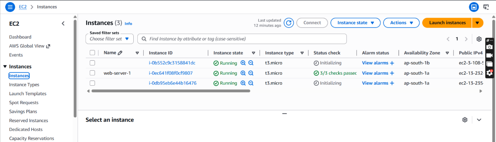
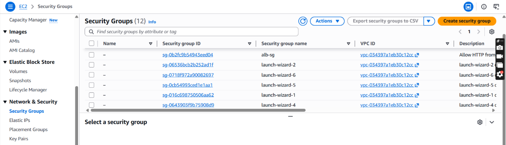
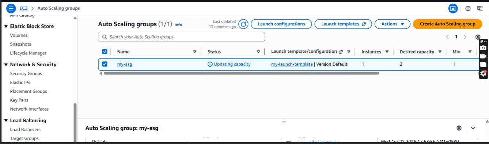

# 🚀 Scalable Web App with ALB and Auto Scaling

## 📌 Overview
This project demonstrates a scalable and highly available web application infrastructure on AWS using Application Load Balancer (ALB) and Auto Scaling Group (ASG). The architecture automatically distributes incoming traffic across multiple EC2 instances and dynamically scales resources based on traffic demand.

---

## 🎯 Objective
To build a fault-tolerant cloud infrastructure capable of handling increasing web traffic automatically without downtime.

---

## 🧰 AWS Services Used
- Amazon EC2
- Application Load Balancer (ALB)
- Auto Scaling Group (ASG)
- Launch Template
- Security Groups
- Amazon VPC

---

# ⚙️ Architecture Workflow

```text
User Request
      │
      ▼
Application Load Balancer
      │
 ┌───────────────┐
 ▼               ▼
EC2 Instance 1   EC2 Instance 2
      │
Auto Scaling Group manages instances automatically
```

---

# 🔄 How It Works

1. User accesses the ALB DNS URL  
2. ALB distributes traffic between EC2 instances  
3. Auto Scaling Group monitors instance health and traffic  
4. New instances are launched automatically during high load  
5. Failed instances are replaced automatically  

---

# 🛠️ Step-by-Step Setup

## 1️⃣ Launch EC2 Instances

Install Apache Web Server:

```bash
sudo yum install httpd -y
sudo systemctl start httpd
sudo systemctl enable httpd
```

Create sample webpage:

```bash
echo "Server 1 is running" > /var/www/html/index.html
```

---

## 2️⃣ Configure Security Groups

### ALB Security Group
Allow:
- HTTP (Port 80) from Anywhere

### EC2 Security Group
Allow:
- HTTP (Port 80) from ALB Security Group
- SSH (Port 22) from your IP

---

## 3️⃣ Create Target Group
- Go to EC2 → Target Groups
- Create a target group
- Register EC2 instances

---

## 4️⃣ Create Application Load Balancer
- Create Internet-facing ALB
- Select availability zones
- Attach Security Group
- Connect Target Group

---

## 5️⃣ Create Launch Template
- Select AMI
- Choose instance type
- Attach EC2 Security Group
- Add User Data Script

---

## 6️⃣ Create Auto Scaling Group
Set:
- Desired Capacity = 2
- Minimum Capacity = 1
- Maximum Capacity = 3

Attach:
- Launch Template
- Load Balancer

---

## 7️⃣ Test the Application
Open the ALB DNS URL in browser:

```text
http://your-alb-dns-name
```

Traffic will automatically route between EC2 instances.

---

# 📸 Screenshots

## 🖥️ Running EC2 Instances


---

## ⚖️ Application Load Balancer


---

## 🔐 Security Groups


---

## 📈 Auto Scaling Group


---

## 🌐 Final Output


---

# 📂 Project Structure

```text
scalable-web-app-alb-autoscaling/
│── screenshots/
│   ├── Instance.png
│   ├── Load_balancer.png
│   ├── Security_Groups.png
│   ├── Auto_Scaling.png
│   └── output1.png
│
│── README.md
```

---

# 💡 Key Features
- High Availability
- Automatic Scaling
- Traffic Distribution
- Fault Tolerance
- Scalable Cloud Infrastructure

---

# 🧠 Learning Outcomes
- Understanding Load Balancers
- Configuring Auto Scaling Groups
- Managing EC2 Infrastructure
- AWS Networking and Security
- Deploying Scalable Applications

---

# 🔮 Future Improvements
- Add CloudWatch Monitoring
- Configure Dynamic Scaling Policies
- Enable HTTPS using ACM
- Integrate Route 53 Domain
- Infrastructure as Code using Terraform

---

# 👩‍💻 Author
**Nitisha Mali**

GitHub: [Nitisha-hub](https://github.com/Nitisha-hub)
